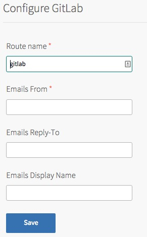

## GitLab Configuration

The following properties can be configured for the GitLab tile

* Route Name - this defaults to `gitlab`, this route is registered against the apps domain configured on the runtime tile. This URL is used to access the GitLab web interface. Only HTTPS connections are accepted, attempts to connect over HTTP will be automatically redirected to HTTPS.

* Emails From - the address to be used when sending e-mail from GitLab, such as `gitlab-no-reply@my-pcf.com`

* Emails Reply-To - the reply to address to be used

* Emails Display name - Friendly name to be shown to users in their inboxes

