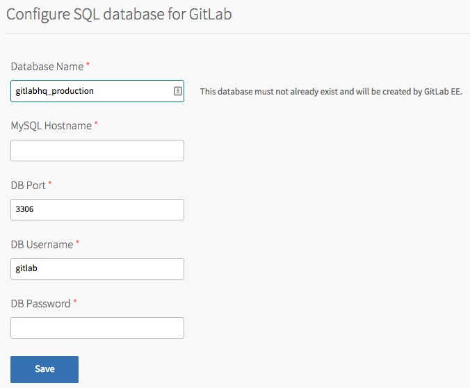
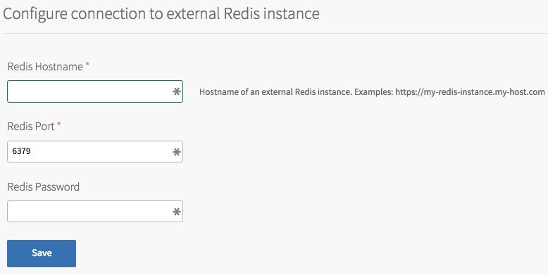
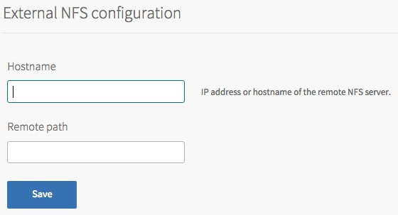
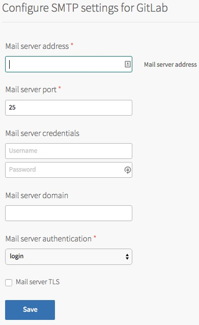

# Dependencies
For the GitLab product to work, it has some dependencies which must be satisfied.

* MySQL
* Redis
* NFS
* SMTP

## MySQL
The product requires an external MySQL database in order to hold its state.

We recommend that you use a MySQL database that is Highly Available to remove any single points of failure from the product.

We have tested using the [MySQL for PCF](https://network.pivotal.io/products/p-mysql) tile as well the hosted [ClearDB](https://console.run.pivotal.io/marketplace/cleardb) offering on http://run.pivotal.io.

However any MySQL compatible database should work.

The required fields to be populated are the following:

* Database name - defaulted to `gitlabhq_production`
* Hostname - this can be a URL or IP address
* DB port
* DB username
* DB password

If the database does not exist it will be created upon installation. All database migrations are performed automatically during upgrades of the tile.

## Redis
The product requires an external Redis database in order to power its background processing queues.

We recommend that you use a Redis database that is Highly Available to remove any single points of failure from the product.

We have tested using the [Redis for PCF](https://network.pivotal.io/products/p-redis) tile as well as the hosted [Redis Labs](https://console.run.pivotal.io/marketplace/rediscloud) offering on http://run.pivotal.io.

However, any Redis database should work.

The required fields to be populated are the following:

* Redis Hostname - this can be a URL or IP address
* Redis port - defaults to 6379
* Redis password

## NFS Storage
The product requires an NFS server to store all of the git repositories on.

We recommend that this NFS server is backed up regularly to protect against data loss.

### Built in NFS server
The product comes with a built in single node NFS server which will be used as default.

This provides an easy way to get started with the product. The size of the persistent disk can be scaled as you required based on the number of repositories you are hosting.

This is a single node NFS server, so it is a single point of failure in the stack.

### Using an external NFS server
You may wish to use an external NFS server instead of the built in product.
This may be because you have an external solution which is Highly Available or wish to use a hardware product instead of software.

The required fields to be populated are the following:

* Hostname - can be an IP address or hostname
* Remote path - if not specified, defaults to the root path on the share

## SMTP
An SMTP server is required in order to send e-mails to users. This is required in order for the user signup flow to work as the user is required to validate their account by clicking on the link they are sent.

We did not use the same settings as configured on the Elastic Runtime tile to give flexibility, in case a separate SMTP server is required to be used.

The required fields to be populated are the following:

* Mail server address - IP address or Hostname
* Mail server port - default is 25 for unsecured SMTP
* Credentials
* Mail server domain - the domain from which the e-mails are sent, e.g. "my-pcf.com"
* Mail server authentication
* Mail server TLS - if enabled ensure you change the mail server port, typically this would be 465

